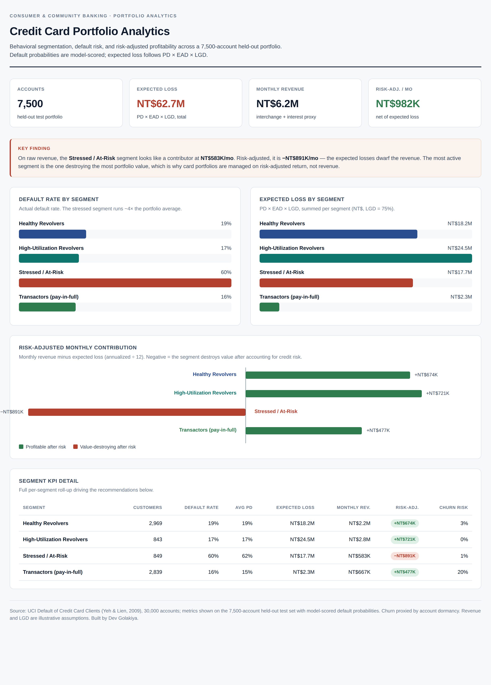
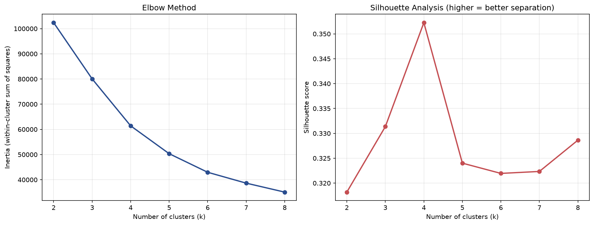
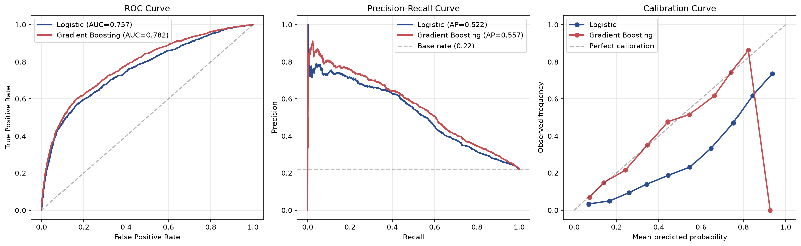

# Credit Card Portfolio Analytics Suite

An end-to-end consumer-credit analytics suite on 30,000 real cardholders: behavioral segmentation, default-risk modeling with fair-lending validation, churn-risk flagging, and a risk-adjusted portfolio P&L — surfaced in an interactive dashboard and a strategic recommendations memo. Built to mirror the work of a consumer-banking portfolio analytics team.

## The dashboard



*Interactive version in [`dashboard.html`](dashboard.html) — open it in a browser for animated charts and the full KPI table.*

## The headline finding

On raw revenue, the **Stressed / At-Risk** segment (11% of accounts) looks like a contributor at NT$583K/month. Risk-adjusted — once expected losses are netted out — it is **−NT$891K/month**, nearly cancelling the contribution of the entire rest of the portfolio. The most *active* segment is the one destroying the most value. This is why card portfolios are managed on risk-adjusted return, not revenue.

## What's inside

| Stage | Module | What it does |
|---|---|---|
| ETL & features | `data_pipeline.py` | Loads UCI data, cleans undocumented category codes, engineers behavioral features (utilization, payment ratio, delinquency, transactor/revolver) |
| Segmentation | `segmentation.py` | K-means behavioral clustering; elbow + silhouette to choose k; isolates a 60%-default stressed segment |
| Default model | `default_model.py` | Logistic regression + gradient boosting; imbalanced-data evaluation (ROC-AUC, PR-AUC, calibration); **fair-lending disparate-impact check** |
| Portfolio KPIs | `portfolio_kpis.py` | Expected Loss (PD × EAD × LGD), revenue proxy, risk-adjusted return, churn proxy |
| Dashboard | `dashboard.html` | Interactive BI dashboard (Tableau/Power BI-style) |
| Strategy | `STRATEGY_MEMO.md` | One-page recommendations for senior management |
| Tests | `test_analytics.py` | 18 tests across data, features, segmentation, and KPI math |

## Dataset

[Default of Credit Card Clients](https://archive.ics.uci.edu/dataset/350/default+of+credit+card+clients) (Yeh & Lien, 2009), UCI ML Repository. 30,000 cardholders, Taiwan, April–September 2005. ~22% default rate (imbalanced). CC BY 4.0. Pulled directly via the `ucimlrepo` package — no manual download.

## Segmentation

K-means on standardized behavioral features (utilization, payment ratio, credit limit, delinquency, spend). Silhouette analysis selected k=4, which also proved the most business-interpretable.



The four segments are economically distinct, validated by a 16%–60% spread in default rates:

| Segment | Share | Default rate | Risk-adjusted contribution |
|---|---|---|---|
| High-Utilization Revolvers | 11% | 17% | +NT$721K/mo |
| Healthy Revolvers | 40% | 19% | +NT$674K/mo |
| Transactors | 38% | 16% | +NT$477K/mo |
| Stressed / At-Risk | 11% | 60% | **−NT$891K/mo** |

## Default model

Two models on purpose: an interpretable logistic regression (the credit-scoring workhorse, explainable under ECOA) and a gradient-boosting challenger (higher performance, used for monitoring). Both evaluated for imbalanced data — accuracy is useless at a 22% base rate, so ROC-AUC, precision-recall, and calibration are the honest metrics.



Gradient boosting reached ROC-AUC 0.78 (logistic regression 0.76), both with PR-AUC above 0.52 — more than double the 0.22 base rate. Recent and chronic delinquency dominated feature importance in both models, consistent with established credit-scoring practice.

**Fair-lending check.** Protected attributes (sex, marital status) were excluded from training; predictions were tested for disparate impact via the four-fifths rule and passed with a **0.996 ratio** (near-perfect parity by sex).

**The precision-recall trade-off.** The class-weighted logistic regression caught 60% of defaulters at a 0.5 threshold; the unweighted gradient-boosting model caught 37% but with far fewer false positives. The threshold is a business decision driven by the relative cost of a missed default versus a wrongly-flagged good customer — not a statistical default.

## Running it

```bash
pip install pandas numpy scikit-learn matplotlib seaborn ucimlrepo pyarrow pytest

python3 data_pipeline.py     # ETL + features -> data/cards_clean.parquet
python3 segmentation.py      # K-means -> data/cards_segmented.parquet
python3 default_model.py     # models + fairness -> data/cards_scored.parquet
python3 portfolio_kpis.py    # KPIs -> data/cards_kpis.parquet, segment_kpis.csv

pytest test_analytics.py -v  # 18 tests

open dashboard.html          # interactive dashboard
```

## What I learned

**Risk-adjusted return reorders everything.** The single most important lesson: a segment can generate real revenue and still destroy portfolio value. Expected Loss (PD × EAD × LGD) is the bridge from a prediction to a business decision, and netting it against revenue is what turns "who spends" into "who's actually profitable."

**Accuracy is the wrong metric for imbalanced credit data.** At a 22% base rate, predicting "no default" for everyone scores 78% accuracy and catches zero defaulters. ROC-AUC, PR-AUC, and calibration are the honest metrics — and calibration matters specifically because banks price risk off the probabilities, not just the ranking.

**Compliance is part of the model, not an afterthought.** A credit model that isn't tested for disparate impact can't be deployed under ECOA. Excluding protected attributes and running the four-fifths check is as much a part of the build as the AUC.

**Real data has undocumented quirks.** The dataset's EDUCATION, MARRIAGE, and PAY_ columns contain codes absent from the documentation. Making defensible, documented decisions about them — rather than silently dropping or ignoring them — is the actual day-to-day of analytics work.

## Limitations

- Churn is proxied by account dormancy (no closure label exists in the data); production use would validate against real attrition outcomes.
- Revenue and LGD are illustrative assumptions, not booked figures.
- A single 2005 Taiwan cross-section — a current US portfolio would require recalibration.
- The gradient-boosting and logistic models use different class weighting, which drives the recall gap; this is deliberate (it surfaces the threshold trade-off) and documented rather than tuned away.

## Tech

Python · pandas · scikit-learn (KMeans, LogisticRegression, GradientBoosting) · matplotlib · HTML/CSS/JS dashboard · pytest

---

Sixth project in a quantitative finance / analytics portfolio. Complements five quant-finance projects (derivatives pricing, Monte Carlo, factor models, VaR, American options) with a consumer-credit analytics build closer to retail-banking portfolio work.
